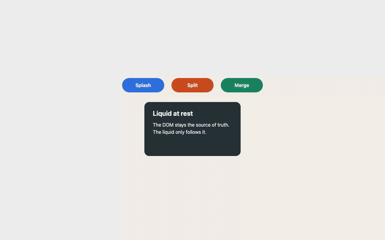

# Whole-picture check after slice 2: "Liquid that reacts"

**Date:** 2026-10-06 · **Commit:** 0c0151d · **Ward:** W69
**Canonical scene and matrix:** [NORTH-STAR.md](../../NORTH-STAR.md) · **Spec:** §6 "WDD with an eye on the whole", item 4

Recorded with `npm run whole-picture` (`e2e/record.spec.ts`, project `record`): Chromium, 1280×800, DPR 1, seed 1, RAF clock (a manual clock would freeze the video), GIF 640 px at 12 fps, 0.82 MiB, 22.96 s. Timings are wall-clock, ±50 ms. Re-form budgets are read from NORTH-STAR.md (D67-1 outcome: option 1, splash 3 s, shake 3 s).

GIF timeline (seconds, same as the video): step 1 idle 0.5–3.0 · step 2 sweep 3.0–8.5 · step 3 click on Splash 12.95, re-formed 15.4 · step 4 focus on Split 15.4, Enter 15.75, re-formed 18.25 · step 6 shake 18.25, re-formed 20.4 · hold to 22.96.
Stills (`s2-step*.png`) are the record spec's shots (`test-results/whole-picture/shots/`, not committed) plus full-resolution video frames and 4× crops extracted with ffmpeg for this report (W69 scratch, not committed): `s2-step1-idle.png` (2.0 s), `s2-step2-sweep.png` (5.75 s), `s2-step3-splash-click.png` (12.95 s), `s2-step3-splash-peak.png` (13.08 s), `s2-step4-keyboard-splash-split.png` (15.9 s), `s2-step6-shake-peak.png` (18.5 s), `s2-step6-reformed.png` (21.5 s), `s2-crop4x-step3-splash-edge.png`, `s2-crop4x-step6-shake-edge.png`, `s2-crop4x-ring-splash-vs-acceptance.png`.

Recording artefact, not a liquid fault: every `page.screenshot()` the record spec takes shows up in the video as one or two washed-out, speckled frames (for example 18.33 s and 20.2 s, the step-6 shots). The PNG shots taken at those moments are clean.

## Renderers

Recorded in **canvas2d only**. This is a fact of slice 2, not a deviation: no WebGPU fluid renderer exists before slice 3, and `renderer: 'auto'` resolves to Canvas2D (D66-2). The WebGPU recording joins the check after slice 4 ("both renderers", spec §6.4).
WebGPU smoke project (soft, C8): 3/3 pass this run (local, M4 Pro); the count of green CI runs toward the 10 needed to make it blocking is not recorded anywhere in the repo (`ci.yml` is not on `master` yet), so it stands at 0 recorded of 10. `adapter.info`: google / swiftshader / isFallbackAdapter true.

## Scene steps

| Step | Scene step | Expected S2 | Observed | Evidence |
|---|---|---|---|---|
| 1 | Idle 2 s: crisp edges, DOM text visible at rest | ✅ C | ✅ crisp pill and card edges, DOM text visible, no fur | acceptance.spec step 1 pass; manifest step 1 at rest after 16 ms; GIF 0.5–3.0 s; s2-step1-idle.png |
| 2 | Pointer sweep: soft bulge, no holes | ✅ C | ✅ no hole in any pill; the bulge is barely visible (edges go fuzzy, 1–2 px swell), see Carried | acceptance.spec step 2 ×4 pass (no-hole alpha, re-form within 3 s, parallel sweep, 2 % swell); GIF 3.0–8.5 s; manifest step 2 at rest 104 ms after the pointer left; s2-step2-sweep.png |
| 3 | Click "Splash": jets and fingers, re-form within 3 s | ✅ C (no text) | ✅ re-formed in 2451 ms (budget 3000 ms); two C-shaped jets left and right, beaded filaments above and below, empty centre | acceptance.spec "step 3 – … within the D67-1 budget" pass; cargo `given_strength_1_splash_on_button_when_ticking_then_rest_alpha_1_within_3_s` pass (135 + 10 frames = 2.42 s); manifest step 3 reacted 80 ms, reformMs 2451 ms (first run 2416 ms); GIF 12.95–15.4 s; s2-step3-splash-150ms.png, s2-step3-splash-peak.png, s2-step3-reformed.png |
| 4 | Tab and Enter on "Split": centre splash, focus ring visible | ✅ | ✅ re-formed in 2496 ms (budget 3000 ms); splash centred on Split, focus ring visible above the liquid in every frame | acceptance.spec step 4 pass; a11y.spec focus-ring test pass; manifest step 4 reacted 24 ms, reformMs 2496 ms (first run 2411 ms); GIF 15.4–18.25 s; s2-step4-focus.png, s2-step4-splash-150ms.png, s2-step4-keyboard-splash-split.png |
| 5 | Drag "Merge" into the card, separate, re-form within 3 s | ⏳ | ⏳ slice 5 | not recorded: liquid-only drag lands in slice 5 (matrix S5) |
| 6 | Shake: everything sloshes, re-form within 3 s | ✅ | ✅ re-formed in 2179 ms (budget 3000 ms); every element moves at once, but it reads as intact blobs sliding rather than sloshing (Carried) | acceptance.spec "step 6 – … within 3 s" pass; cargo `given_shake_strength_1_when_ticking_then_all_rest_alpha_1_within_3_s` pass (120 + 10 frames = 2.17 s); manifest step 6 reacted 74 ms, reformMs 2179 ms; GIF 18.25–20.4 s; s2-step6-shake-200ms.png, s2-step6-shake-peak.png, s2-step6-reformed.png |
| 7 | Scroll 300 px and back: the liquid follows with no snap | ⏳ | ⏳ slice 6 | not recorded: scroll lands in slice 6 (matrix S6) |
| 8 | Modes: reduced motion and print (device.lost slice 3, forced colours slice 4) | ✅ | ✅ every modes and a11y test passed in canvas2d | modes.spec 5/5 functional pass (reduced motion media: restAlpha 1 on the first frame and two frames 1 s apart identical, 294 ms; ?rm=1 293 ms; print canvas display none 135 ms; forced colours 127 ms; hover background 206 ms), 2 visual baselines skipped on macOS (Linux-only, D65-2); a11y.spec 2/2 pass (axe 0 violations, canvas aria-hidden, focus ring above the liquid) |

Splash scene (`demo/scenes/splash.html`, scenes.spec): pass (13.2 s, no console error, every element back to restAlpha 1); `cellPx()` = 8. Per-element viscosity visibly different: not inspected frame by frame in this check; the Thin/Medium/Thick labels and their per-element options are in place (D69-3).
Playground (`demo/scenes/playground.html`): presets water/honey/jelly distinct at 150 ms after "Splash every element" (water: spiky star with many small holes; honey: rounder lobes with one large hole; jelly: sharp star arms), restored after reload: pass (scenes.spec).
Published dist (D69-6, `e2e/dist.spec.ts`, project `dist`): pass against `examples/react` built on the core `dist` (`npm run e2e:dist:build` then `--project=dist`, 826 ms).

Full canvas2d run: 26 passed, 8 skipped (Linux-only visual baselines and the VISION=1 capture), 0 failed.

## Carried

Carried into this check by D69-5 (saga dec_035bc206) from the W67 and W68 gold notes and the W67 perf review. W69 changes no engine behaviour: each row is evidence plus one recommendation, and Dennis decides at gold what is tuned, and whether in a fix ward before slice 3 or inside slice 3.

| Item | Evidence | Recommendation |
|---|---|---|
| DOM text contrast while the liquid is away | Probe (WCAG ratio of the text colour on the page background, which is what the text sits on when its liquid has left): acceptance Splash/Split/Merge white on #f3efe6 = 1.15:1, card #f5f5f5 = 1.05:1; playground Circle #04202e on #0a0a12 = 1.17:1, Rectangle #1e1037 = 1.11:1 (Pill and Rounded card 19.72:1 are fine). Frames: s2-step3-splash-peak.png (13.08 s, "Splash" invisible in the empty centre), s2-step4-keyboard-splash-split.png ("Split" invisible inside the focus ring), s2-step6-shake-peak.png ("Splash", "Split" and the first letters of the card text on the page) | Small fix ward before slice 3, TS and CSS only: at observe() set `--liquid-bg` to the snapshotted background colour and add one static rule in `@layer liquiddom` (screen, forced-colors none): `text-shadow: 0 0 2px var(--liquid-bg), 0 0 4px var(--liquid-bg)`. At rest the halo is the liquid's own colour and invisible; when the liquid is away the text keeps its own AA contrast (≥ 4.5:1) against the halo. No per-frame DOM write, so D7 / "rendering never touches the DOM" holds. Slice 4 liquid text makes this moot only for WebGPU; the Canvas2D fallback never gets liquid text, so it needs this anyway |
| Furry in-motion edges (density renderer) | 4× crops s2-crop4x-step3-splash-edge.png and s2-crop4x-step6-shake-edge.png: the fur sits in thin filaments, which break into chains of 2–6 px beads (speckle along the splash ring), and in a stair-stepped, ~2 px soft threshold band from the 2 px density grid; the bulk shake contour is lumpy but not furry. Constants: `KERNEL_RADIUS_CAP_PX = 8`, `KERNEL_RADIUS_PER_SPACING = 2.3`, `DENSITY_THRESHOLD = 0.5`, `EDGE_SOFTNESS = 0.1`, `DEFAULT_SCALE_PX = 2` | Inside slice 3: superseded by the WebGPU splat and composite; no Canvas2D change before it. If Dennis wants the fallback smoother anyway, the one value to try in a fix ward is `KERNEL_RADIUS_PER_SPACING` 2.3 → 2.8 (joins the bead chains into filaments; check with the same crops), not `DEFAULT_SCALE_PX` 1 (4× the grid cost) |
| Shake reads as sliding blobs | Frames GIF 18.25–20.4 s at 8–12 fps and s2-step6-shake-peak.png: Splash and Split move ~45 px up as intact pills, the card ~10 px right, edges lumpy. Playground probe, 200 ms after `shake(s)` (9 shots): strength 0.5, all three presets: no visible translation, only rougher edges; 1.0, all presets: every shape translates 20–40 px intact (rigid sliding); 2.0 water: shapes deform (circle lumpy, card wavy), the closest to sloshing; 2.0 honey: pill and rectangle shear, stretch and overlap; 2.0 jelly: circle pushed into the card, rectangle intact. Cause in code: `interaction::shake` gives every particle of an element the same direction plus per-particle white noise (`SHAKE_NOISE = 0.9`), and the noise averages out | Not tuning but the impulse shape, so an engine change: a small engine ward before slice 3 (slice 3 is renderer work). Replace the per-particle white noise with a spatially coherent field per element, e.g. velocity = dir · speed · (1 + 0.8 · sin(π · (x − cx) / (w / 2) + φ)) plus a rotation term ω × (r − c) with ω = 0.5 · speed / max(w, h); keep `SHAKE_SPEED_PX_S = 520`. Guard: the W67 shake re-form tests (≤ 3 s) and the no-NaN stress test |
| Pointer-bulge strength (drag 6.0) | `POINTER_DRAG_PER_S = 6.0`, `POINTER_RADIUS_PX = 70` (`src/fluid/interaction.rs`). Playground probe on the 200×60 Pill, canvas alpha ≥ 128 bounding box at mid-sweep vs rest: 300 px/s edges +2 px left/right and +1/+2 px top/bottom, centroid shift 0.14 px; 600 px/s +1–2 px, centroid shift 0.99 px; 1200 px/s +2 px, centroid shift 1.22 px; area +0.8 to +1.9 %, most of it the 2 % hover swell. Vision (s2-step2-sweep.png, playground sweep shots): edges go fuzzy, no bulge readable as following the pointer | Raise `POINTER_DRAG_PER_S` 6.0 → 12.0 in a small fix ward before slice 3 (an engine constant, so never in W69), and keep `POINTER_RADIUS_PX = 70`. Guard: the W68 no-hole tests (canvas alpha inside each pill never below the fill threshold) and the step-2 re-form within 3 s; accept the value only if a mid-sweep centroid shift of ≥ 3 px is visible in a shot |
| Material preset tuning | Playground probe, "Splash every element" at strength 1, shots at 150 ms, 1050 ms and after re-form per preset: water {0.15, 0.3, 0.5}: spiky star, many small torn holes, visually re-formed by 1050 ms; honey {0.9, 0.7, 1.6}: shorter, rounder lobes but one large central hole per element, visually re-formed by 1050 ms apart from fuzzy edges; jelly {0.6, 0.85, 0.4}: sharp star arms, large holes, re-formed by 1050 ms. Honey's large hole reads as "torn", not as "thick" | Keep water and jelly as is. Honey: try `{ viscosity: 0.9, cohesion: 0.9, recovery: 1.2 }` (higher cohesion against the torn hole, shorter recovery so it does not lag behind visibly), untested here: Dennis confirms it in the playground with "Copy material JSON". Small fix ward before slice 3; changing `presets` in `packages/core/ts/src/material.ts` changes public API values, so it needs a changeset |
| Ring density when the area hint is off | Probe: acceptance (hint from autoObserve) `cellPxOf(instance)` = 6.167 px (bench-opt-level agrees: 6.167; the B5 formula with 77 760 px² gives 6.24), ring spacing 3.08 px vs interior spacing √(76 057 / 8000) = 3.08 px (0 %); splash scene (`autoObserve: false`, no hint) `cellPx()` = 8 px, ring spacing 4.0 px vs interior √(147 200 / 8000) = 4.29 px (ring 7 % denser). Crops s2-crop4x-ring-splash-vs-acceptance.png: at rest both edges are the exact roundRect, no difference visible. Risk case (computed, not observed): one 140×48 button with no hint gives interior 0.92 px vs ring 4 px | Keep for the splash scene and the playground (ring within 7 % of the interior). Put "derive the area hint from the first observe() batch when autoObserve is off, then redistribute" into slice 6 ("The world"), where adapters and real pages without autoObserve arrive; no fix ward before slice 3 |

## Feel against the north star

At rest the scene is exactly the page: crisp pills and card, real DOM text, nothing that gives away a canvas. A click does read as liquid: two C-shaped jets leave the button, the top and bottom sheets thin into beaded filaments, and about 2.4 s later the button is back, so the T-1000 promise holds for splash and keyboard splash. Three things look fake in Canvas2D: the DOM text is left hanging on the page in white-on-beige while its liquid is away; thin sheets break into speckled bead chains and the moving contour is soft and stair-stepped; and a shake moves whole elements as rigid blobs instead of setting them sloshing. A fourth, smaller one is new in this check: while restAlpha is between 0 and 1 (hover swell, the last part of a re-form) the fill goes translucent for 6–8 frames (centre alpha down to 142/255 at restAlpha 0.58, 42 of 439 sampled frames in a hover-and-splash probe), which is the pale flash visible on Split and Merge in the GIF around 6.5 s and 16.5 s. The pointer is felt only as fuzz, not as a bulge. What waits for slice 3 is the look: splat-based edges and, in slice 4, liquid text.

## Perf

Provisional (W65, C1). At 8000 particles in the acceptance scene, perf project, this machine Apple M4 Pro (local, not CI):
- p95 Rust `tick` per fixed step: 3.560 ms, mean 3.252 ms (dev reference: M4 Pro ≈ 2.8 ms mean without F).
- RAF callback p95: 3.625 ms, mean 3.335 ms, n = 301 (budget ≤ 12 ms).
- opt-level result (`node scripts/bench-opt-level.mjs`, re-run for this check, Node 24.9, 600 ticks × 3 rounds): opt-level 3 is faster, 3.285 ms vs 3.815 ms median mean per step with the pointer inactive and 3.594 ms vs 3.977 ms with a pointer sweep (p95 3.502 vs 4.053 ms); WASM 90 243 vs 82 101 bytes. `Cargo.toml` keeps opt-level 3.
CI baseline recorded: no. `e2e/perf-baseline.json` does not exist (D65-8), so the 1.2× budget is not enforceable yet. The tick mean rose from the ≈ 2.8 ms dev reference to ≈ 3.3 ms over slice 2 (pointer field, splash and shake paths).

## Drift check

- Engine is MLS-MPM in Rust (`src/fluid/`); soft-body identifiers in `src/` and `packages/core/ts/src/`: none (`grep EntityBody|PARTICLES_PER_BODY|liquid_type` is empty).
- Every visible motion comes from the solver (no TS-side animation of rects or DOM): yes. The hover swell is a step change of the home rect in the element buffer (B1, `fluid-layout.ts`, `layout.rs`); the liquid gets there through the solver.
- Re-form is real (restAlpha from Rust, DOM text at rest), not a timer: yes. The cargo re-form tests count solver frames (135 and 120 frames), and the e2e tests wait on `restAlpha()` from the state view.
- Anything built that the north star does not ask for, or skipped that it does: none built beyond it. Skipped against the S2 column: nothing; the visible gaps are quality (sloshing, bulge, text contrast), not missing steps.

## Open points for slice 3

- No ❌ in this check. The quality gaps are the six Carried rows plus one new renderer finding: the Canvas2D restAlpha cross-fade (`fluid-canvas2d.ts` draws the roundRect at `globalAlpha = restAlpha` over a density field weighted `1 − restAlpha`) leaves the fill translucent mid-transition (alpha 142/255 at restAlpha 0.58). Owner: renderer. Fix option: draw the density field at full weight whenever restAlpha < 1, or composite the two with max instead of a weighted sum; a small fix ward, or inside slice 3 if the WebGPU composite is designed to share the rule.
- Fixed in W69 (90ce484): `e2e/record.spec.ts` wrote `video.path()` into the manifest before the page closed, so `npm run whole-picture`'s conversion step failed with "input not found"; this recording was converted from the moved `video.webm` by hand. The spec now closes the page and calls `video.saveAs(tmp/whole-picture/slice-2.webm)` first; the pipeline was re-run end to end (GIF89a 0.87 MiB). The manifest itself still lives in `test-results/whole-picture/` (pinned by whole-picture-tooling), so a parallel Playwright run can delete it; re-run the record step in that case.
- D67-1 re-form timing outcome: option 1 (`REST_S_MIN` 0.98 → 0.95, ward-067 Decision line, saga dec_fe306ff0); budgets in NORTH-STAR are splash 3 s and shake 3 s; measured 2451 ms (step 3, margin 549 ms), 2496 ms (step 4, margin 504 ms), 2179 ms (step 6, margin 821 ms); cargo evidence 135 + 10 frames (splash) and 120 + 10 frames (shake) at 60 Hz.
- D68-2 preset values: keep water and jelly; retune honey after Dennis' playground session (Carried row).
- Spec §7 open points still open: render scale for T0 (0.5× vs 0.75×), what happens to the published `0.2.0-rc.0`, F every substep vs every 2nd substep (slice 4).
- WebGPU smoke project: 0/10 recorded green CI runs (3/3 pass locally this run).

## Recommendation

Proceed to plan slice 3 (WebGPU liquid), after one small fix ward that takes the cheap, renderer-independent items: the DOM-text halo (Canvas2D keeps needing it), the shake impulse shape, `POINTER_DRAG_PER_S` 12, the honey preset after the playground session, and the Canvas2D cross-fade dip. Furry edges go into slice 3 and ring density into slice 6. This is a recommendation only. **Dennis decides; slice 3 is planned only after his review of this check.**
